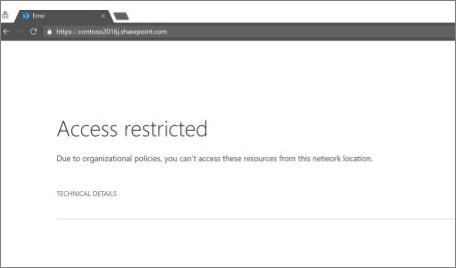
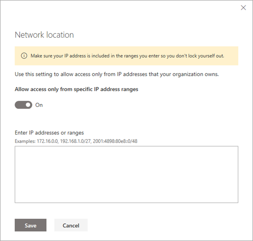

# Control access to SharePoint and OneDrive data based on network location

As an IT admin, you can control access to SharePoint and OneDrive resources in Microsoft 365 based on defined network locations that you trust. This is also known as location-based policy.
  
To do this, you define a trusted network boundary by specifying one or more authorized IP address ranges. Any user who attempts to access SharePoint and OneDrive from outside this network boundary (using web browser, desktop app, or mobile app on any device) will be blocked.

  

  
Here are some important considerations for setting a location-based policy:
  
- **External sharing**: If files and folders have been shared with guests who authenticate, they will not be able to access the resources outside of the defined IP address range. 
    
- **Access from first and third-party apps**: Normally, a SharePoint document can be accessed from apps like Exchange, Yammer, Skype, Teams, Planner, Power Automate, PowerBI, Power Apps, OneNote, and so on. When a location-based policy is enabled, apps that do not support location-based policies are blocked. The only apps that currently support location-based policies are Teams, Yammer, and Exchange. This means that all other apps are blocked, even when these apps are hosted within the trusted network boundary. This is because SharePoint cannot determine whether a user of these apps is within the trusted boundary.
    
    > [!NOTE]
    > We recommend that when a location-based policy is enabled for SharePoint, the same policy and IP address ranges should be configured for Exchange and Yammer. SharePoint relies on these services to enforce that the users of these apps are within the trusted IP range. For protecting access to SharePoint via the Office.com portal we recommend using the Azure Active Directory conditional access policy for "Office 365" and configuring the trusted IP range there. 
  
- **Access from dynamic IP ranges**: Several services and providers host apps which have dynamic originating IP addresses. For example, a service that accesses SharePoint while running from one Azure data center may start running from a different data center due to a failover condition or other reason, thus dynamically changing its IP address. The location-based conditional access policy relies on fixed, trusted IP address ranges. If the IP address range cannot be determined up front, location-based policy may not be an option for your environment.

## Set a location-based policy in the new SharePoint admin center

> [!NOTE]
> It can take up to 15 minutes for these settings to take effect. 
  
1. Go to the [Access control page of the new SharePoint admin center](https://admin.microsoft.com/sharepoint?page=accessControl&modern=true), and sign in with an account that has [admin permissions](./sharepoint-admin-role.md) for your organization.

>[!NOTE]
>If you have Office 365 Germany, [sign in to the Microsoft 365 admin center](https://go.microsoft.com/fwlink/p/?linkid=848041), then browse to the SharePoint admin center and open the Access control page.  If you have Office 365 operated by 21Vianet (China), [sign in to the Microsoft 365 admin center](https://go.microsoft.com/fwlink/p/?linkid=850627), then browse to the SharePoint admin center and open the Access control page.
    
2. Select **Network location**, and turn on **Allow access only from specific IP address ranges**.

    
    
3. Enter IP addresses and address ranges separated by commas.
  
    > [!IMPORTANT]
    > Make sure you include your own IP address so you don't lock yourself out. This setting not only restricts access to OneDrive and SharePoint sites, but also to the OneDrive and SharePoint admin centers, and to running PowerShell cmdlets. If you lock yourself out and can't connect from an IP address within a range you specified, you will need to contact Support for help.  If you save overlapping IP addresses, your users will see a generic error message with a correlation ID that points to "The input IP allow list has overlaps."
    
> [!NOTE]
> To set a location-based policy by using PowerShell, run Set-SPOTenant with the -IPAddressAllowList parameter. For more info, see [Set-SPOTenant](/powershell/module/sharepoint-online/set-spotenant?view=sharepoint-ps&preserve-view=true).